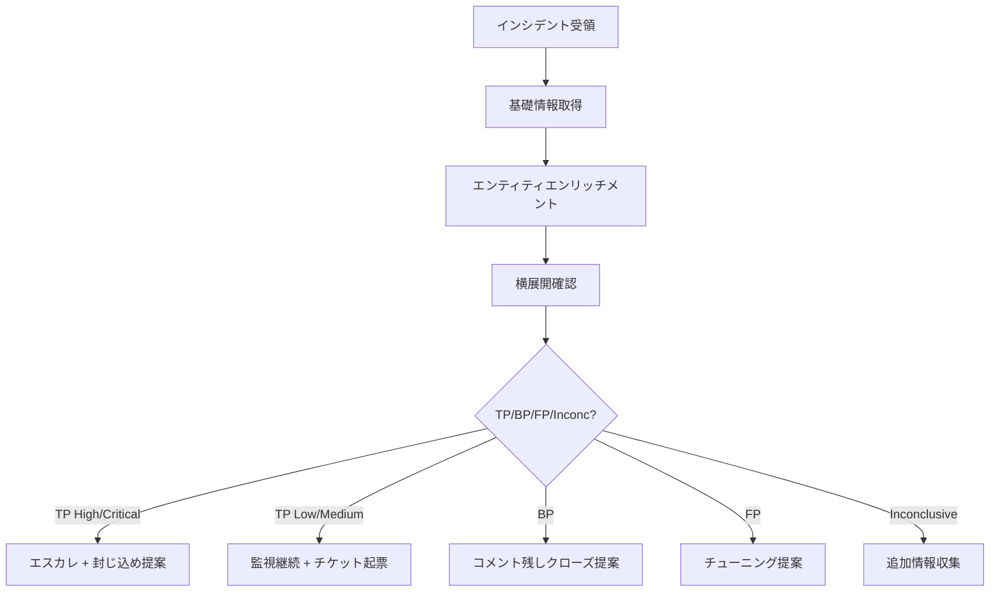

# SKILL: Incident Triage Workflow

**いつ使うか**: Sentinel インシデントを受けて初動トリアージを行うとき。

## トリアージの目的

1. **本物か(TP/BP/FP)を素早く判定**
2. **影響範囲を確定**(ユーザー / デバイス / リソース)
3. **次の対応(エスカレ / 封じ込め / クローズ)を決定**

## 標準フロー

## 判断基準

### True Positive(本物の脅威)
- 明確な悪意ある行為(マルウェア実行、データ持ち出し、特権昇格)が観測
- IOC が信頼できる TI フィードに合致

### Benign Positive(本物だが業務上正当)
- ペネトレーションテスト / レッドチーム
- 管理者の通常作業(ただし要記録)

### False Positive(誤検知)
- 検知ロジックの想定外シナリオ
- 既知の業務アプリ / バッチによる発火

### Inconclusive(判定不能)
- データが不足している(ログ欠損 / 期間外)
- 判定可能になるまで Open のまま情報収集

## 確度(Confidence)

| 確度 | 条件 |
| --- | --- |
| High | 複数の独立した証拠で TP / FP が確定 |
| Medium | 主要な証拠はあるが、一部仮説 |
| Low | 状況証拠のみ、追加調査が必要 |

## エスカレーション基準(例)

- Severity High 以上の TP → Tier2 へ即時通知
- 特権アカウント関与 → Tier2 へ即時通知
- データ持ち出しの兆候 → Tier2 + IR Manager
- ランサムウェア兆候 → IR チーム招集

## トリアージの最低限のクエリセット

[.github/prompts/triage-incident.prompt.md](../../.github/prompts/triage-incident.prompt.md) を参照。

## アンチパターン

- ❌ アラートタイトルだけで FP 判定する
- ❌ 一つのテーブルだけで結論を出す
- ❌ 機械的に Close する(誰のためのインシデントか考えない)
- ❌ ユーザー本人への確認なしに「業務利用」と決めつける
