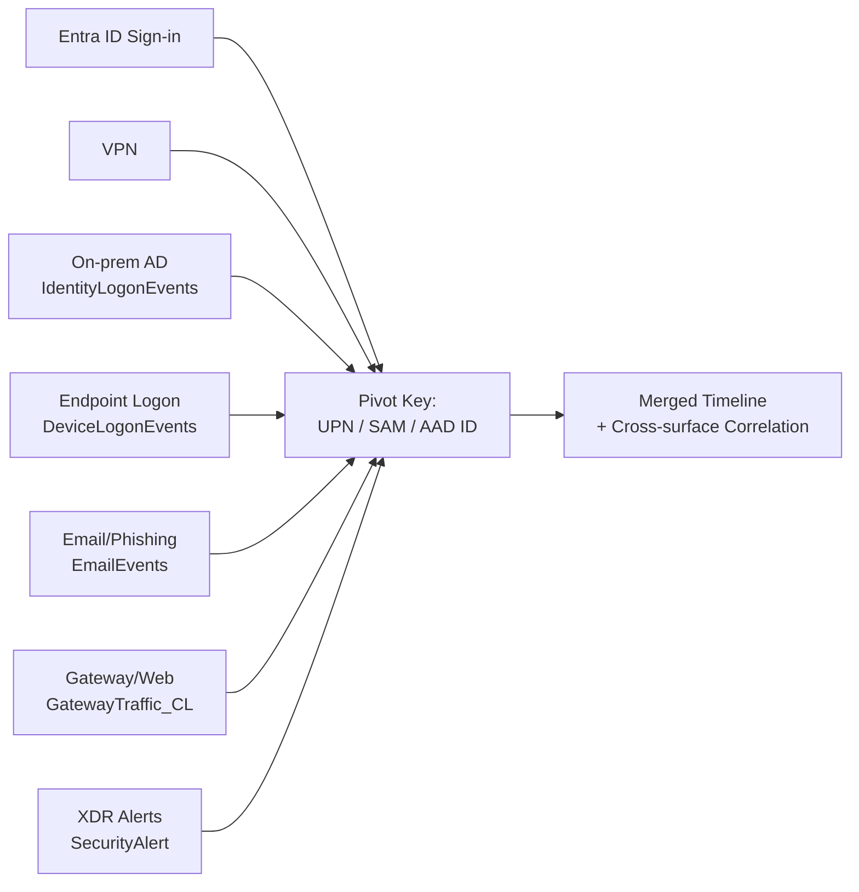

# SKILL: Suspicious User Investigation

**いつ使うか**: ユーザーから「怪しいユーザーを調べて」「最近不審な動きがあるアカウントは?」のような**あいまいで広範な依頼**を受けたとき。  
特定ユーザー名がすでに与えられている場合は、本スキルの §3「入口別深掘り」と §4「相関」だけを使う。

---

## 0. 設計思想

ユーザー活動は **複数の入口(Attack Surface)** に分散して記録される。1 つのテーブルだけで判断すると見落とすため、**入口ごとに独立して分析 → 相関で束ねる** 二段構えで進める。



---

## 1. 候補抽出フェーズ(Discover)

ユーザー名が未指定なら、まず**怪しいユーザー候補 Top N** を作る。各入口から並列にスコアを集めて統合する。  
**全クエリは時間範囲必須**(`copilot-instructions.md` §5)。初期は `ago(30d)` 推奨。

### 1.1 入口別の候補抽出クエリ(並列実行)

#### Entra ID Sign-in
```kusto
SigninLogs
| where TimeGenerated >= ago(30d)
| summarize Total=count(), Failed=countif(ResultType != 0),
            UniqueIPs=dcount(IPAddress),
            UniqueCountries=dcount(tostring(LocationDetails.countryOrRegion)),
            Countries=make_set(tostring(LocationDetails.countryOrRegion), 5)
        by User=tolower(UserPrincipalName)
| extend FailRate = round(todouble(Failed)*100/Total, 1)
| where Failed >= 5 or UniqueCountries >= 2 or FailRate >= 50
| project Source="Entra-Signin", User, Score=Failed + UniqueCountries*10, Detail=pack("Failed",Failed,"Countries",Countries,"FailRate",FailRate)
```

#### VPN
```kusto
VPNAuthEvents_CL
| where TimeGenerated >= ago(30d)
| extend User=tolower(SourceUserName)
| where isnotempty(User)
| summarize Total=count(), Failed=countif(EventOutcome =~ "failure"),
            UniqueIPs=dcount(SourceIP), IPs=make_set(SourceIP, 10)
        by User
| where Failed >= 5 or UniqueIPs >= 3
| project Source="VPN", User, Score=Failed + UniqueIPs*5, Detail=pack("Failed",Failed,"IPs",IPs)
```

#### On-prem AD (MDI)
```kusto
IdentityLogonEvents
| where TimeGenerated >= ago(30d)
| extend User=tolower(AccountUpn)
| where isnotempty(User) and User !endswith "$"  // computer account 除外
| summarize Total=count(), Failed=countif(ActionType == "LogonFailed"),
            UniqueDevices=dcount(DeviceName), UniqueIPs=dcount(IPAddress),
            FailReasons=make_set(FailureReason, 5)
        by User
| where Failed >= 5 or UniqueDevices >= 5
| project Source="OnPrem-AD", User, Score=Failed + UniqueDevices*3, Detail=pack("Failed",Failed,"Devices",UniqueDevices,"Reasons",FailReasons)
```

#### Endpoint Logon (MDE)
```kusto
DeviceLogonEvents
| where TimeGenerated >= ago(30d)
| extend User=tolower(AccountName)
| where isnotempty(User) and User !endswith "$" and User !in ("system","local service","network service","anonymous logon")
| summarize Total=count(), Failed=countif(ActionType == "LogonFailed"),
            UniqueDevices=dcount(DeviceName), LogonTypes=make_set(LogonType, 5)
        by User
| where Failed >= 5 or UniqueDevices >= 3
| project Source="Endpoint-Logon", User, Score=Failed + UniqueDevices*2, Detail=pack("Failed",Failed,"Devices",UniqueDevices,"Types",LogonTypes)
```

#### XDR Alerts(全入口横断の最強シグナル)
```kusto
SecurityAlert
| where TimeGenerated >= ago(30d)
| mv-expand entity = todynamic(Entities)
| where tostring(entity.Type) in ("account","useraccount")
| extend Name=tostring(entity.Name), UPN=tostring(entity.UPNSuffix), AadId=tostring(entity.AadUserId)
| extend User=tolower(coalesce(iff(isnotempty(Name) and isnotempty(UPN), strcat(Name,"@",UPN), ""), Name, AadId))
| where isnotempty(User) and User !endswith "$" and User !in ("system","")
| summarize AlertCount=count(), HighSev=countif(AlertSeverity in ("High","Critical")),
            Alerts=make_set(AlertName, 10), Tactics=make_set(Tactics, 10)
        by User
| project Source="XDR-Alerts", User, Score=AlertCount*2 + HighSev*10, Detail=pack("Alerts",Alerts,"Tactics",Tactics,"AlertCount",AlertCount)
```

#### Email(フィッシング着信被害者)
```kusto
EmailEvents
| where TimeGenerated >= ago(30d)
| where ThreatTypes != "" or DeliveryAction in ("Quarantined","Blocked")
| extend User=tolower(RecipientEmailAddress)
| summarize MaliciousCount=count(), Threats=make_set(ThreatTypes, 5)
        by User
| where MaliciousCount >= 1
| project Source="Email", User, Score=MaliciousCount*5, Detail=pack("Malicious",MaliciousCount,"Threats",Threats)
```

### 1.2 候補統合と Top N 出力

各入口の結果を `union` し、**ユーザー単位で多入口にまたがるほど高スコア**にする(クロス入口は強い兆候)。

```kusto
let entraCandidates = (...);
let vpnCandidates = (...);
let onpremCandidates = (...);
let endpointCandidates = (...);
let xdrCandidates = (...);
let emailCandidates = (...);
union entraCandidates, vpnCandidates, onpremCandidates, endpointCandidates, xdrCandidates, emailCandidates
| summarize TotalScore=sum(Score), SurfacesHit=dcount(Source),
            Surfaces=make_set(Source), Details=make_bag(pack(Source, Detail))
        by User
| extend FinalScore = TotalScore + (SurfacesHit-1)*30  // 多面ヒットは加算
| order by FinalScore desc
| take 10
```

> ヒューリスティックなので、しきい値は環境に合わせて調整可。

---

## 2. 報告: Discover フェーズの出力(候補一覧)

**この時点でユーザーへ提示する形**:

```markdown
## 候補ユーザー Top N(過去 30 日)

| 順位 | User | スコア | 関与した入口 | 主な所見 |
| --- | --- | --- | --- | --- |
| 1 | `svroperator001@example.com` | 380 | Entra-Signin / VPN / OnPrem-AD / XDR-Alerts | XDR High 多数, VPN brute force, AD 認証失敗 |
| 2 | ... |  |  |  |

> 続けて深掘り対象を選んでください(既定: 上位 1 件)。
```

ユーザーが「全部」「上位 3 件」など指定した場合は、§3 と §4 を**選んだユーザーごとに繰り返す**。

---

## 3. 入口別深掘りフェーズ(Per-Surface Drilldown)

ユーザーが特定されたら、入口ごとに**独立した節**として書く。各節は同一構造で揃える。

### 3.1 各入口で必ず出す情報

| 項目 | 内容 |
| --- | --- |
| 期間 | First / Last の TimeGenerated |
| 件数 | 成功 / 失敗 |
| 送信元 | IP, ASN, 国, デバイス名 |
| 異常指標 | brute force, 地理跳躍, MFA 失敗, 異常時刻 等 |
| 関連アラート | この入口由来の `SecurityAlert` |
| 評価(暫定) | この入口単独で見た TP/BP/FP/Inconclusive |

### 3.2 入口別クエリパターン

#### Entra ID
```kusto
SigninLogs
| where TimeGenerated >= ago(30d)
| where tolower(UserPrincipalName) == "<user>"
| summarize Count=count(), First=min(TimeGenerated), Last=max(TimeGenerated),
            Apps=make_set(AppDisplayName, 10), IPs=make_set(IPAddress, 10),
            Countries=make_set(tostring(LocationDetails.countryOrRegion), 10),
            ResultTypes=make_set(ResultType, 10), MFAs=make_set(AuthenticationRequirement, 5)
        by ConditionalAccessStatus, RiskState, RiskLevelDuringSignIn
```

#### VPN
```kusto
VPNAuthEvents_CL
| where TimeGenerated >= ago(30d)
| where tolower(SourceUserName) == "<user>"
| summarize Count=count(), First=min(TimeGenerated), Last=max(TimeGenerated),
            Failed=countif(EventOutcome =~ "failure"),
            Success=countif(EventOutcome =~ "success"),
            IPs=make_set(SourceIP, 10), Actions=make_set(DeviceAction, 5)
        by Vendor=DeviceVendor, Product=DeviceProduct
```

#### On-prem AD
```kusto
IdentityLogonEvents
| where TimeGenerated >= ago(30d)
| where tolower(AccountUpn) == "<user>"
| summarize Count=count(), First=min(TimeGenerated), Last=max(TimeGenerated),
            Devices=make_set(DeviceName, 10), Targets=make_set(TargetDeviceName, 10),
            FailReasons=make_set(FailureReason, 10)
        by ActionType, LogonType, Protocol
```

#### Endpoint Logon
```kusto
DeviceLogonEvents
| where TimeGenerated >= ago(30d)
| where tolower(AccountName) == "<user>"
| summarize Count=count(), First=min(TimeGenerated), Last=max(TimeGenerated),
            Devices=make_set(DeviceName, 10), RemoteIPs=make_set(RemoteIP, 10)
        by ActionType, LogonType
```

#### XDR Alerts(入口横断だが、入口別に再分類して見せる)
```kusto
SecurityAlert
| where TimeGenerated >= ago(30d)
| where Entities has "<user-localpart>"
| extend Surface = case(
    ProductName has "Identity Protection" or AlertName has "sign-in" or AlertName has "Sign in", "Entra",
    AlertName has "VPN" or AlertName has "brute force", "VPN",
    ProductName has "Defender for Identity" or AlertName has "Kerberos" or AlertName has "DCSync" or AlertName has "pass-the-hash" or AlertName has "overpass-the-hash", "OnPrem-AD",
    ProductName has "Defender for Endpoint" or AlertName has "LSASS" or AlertName has "Mimikatz", "Endpoint",
    ProductName has "Defender for Office", "Email",
    "Other")
| project TimeGenerated, Surface, AlertName, AlertSeverity, Tactics, Techniques
| order by TimeGenerated asc
```

---

## 4. 相関フェーズ(Cross-Surface Correlation)

複数入口にまたがる場合、**時系列のひとつの物語**にまとめる。これがレポートの中核価値。

### 4.1 統合タイムライン

入口別イベントを `union` してひとつの表に。`Surface` 列を必ず付ける。

```kusto
let user = "<user>";
let lookback = 30d;
union
    (SigninLogs | where TimeGenerated >= ago(lookback) and tolower(UserPrincipalName) == user
        | project TimeGenerated, Surface="Entra", Event=strcat("Signin ResultType=", ResultType, " IP=", IPAddress, " App=", AppDisplayName)),
    (VPNAuthEvents_CL | where TimeGenerated >= ago(lookback) and tolower(SourceUserName) == user
        | project TimeGenerated, Surface="VPN", Event=strcat("VPN ", EventOutcome, " from ", SourceIP)),
    (IdentityLogonEvents | where TimeGenerated >= ago(lookback) and tolower(AccountUpn) == user
        | project TimeGenerated, Surface="OnPrem-AD", Event=strcat(ActionType, " ", LogonType, " on ", DeviceName, iff(isnotempty(FailureReason), strcat(" reason=",FailureReason),""))),
    (DeviceLogonEvents | where TimeGenerated >= ago(lookback) and tolower(AccountName) == user
        | project TimeGenerated, Surface="Endpoint", Event=strcat(ActionType, " ", LogonType, " on ", DeviceName, iff(isnotempty(RemoteIP), strcat(" from ",RemoteIP),""))),
    (SecurityAlert | where TimeGenerated >= ago(lookback) and Entities has user
        | project TimeGenerated, Surface="XDR-Alert", Event=strcat("[", AlertSeverity, "] ", AlertName))
| order by TimeGenerated asc
| take 200
```

### 4.2 入口横断のリンク条件

次の**橋渡しシグナル**を必ずチェック:

| 橋渡し | 検出方法 |
| --- | --- |
| 外部 → 内部 | VPN 成功直後(±15 分)に On-prem AD / Endpoint で同ユーザーの新規ログオン |
| 入口 A の brute force 後の入口 B での成功 | 同ユーザー × 失敗群 → 数分後の成功 |
| クラウド ↔ オンプレ ID マッピング | `IdentityInfo`(あれば) / UPN で照合。`AAD account` と `AD account` が同人物か |
| デバイス起点の侵害 | Endpoint 上の Mimikatz → そのデバイスが Source の AD/VPN 認証 |
| メール起点 | フィッシングメール受信 → 受信者が直後にサインイン異常 / トークン窃取 |

### 4.3 出力: 入口関連図

複雑な相関は Mermaid で可視化(レポート可読性が大幅向上):

```markdown
```mermaid
flowchart LR
    VPN[VPN: brute force from<br/>Tor exit nodes] --成功推定--> AD[On-prem AD:<br/>RDP logon to mscosvr01]
    AD --LSASS dump--> CRED[Mimikatz on mscosvr01]
    CRED --pass-the-hash--> LATERAL[Lateral RDP<br/>mscosvr02]
    EMAIL[Phishing mail<br/>(参考、本ケースでは無関与)] -.該当なし.-> AD
    classDef hit fill:#fdd
    class VPN,AD,CRED,LATERAL hit
\```
```

---

## 5. 最終レポート構造(あいまい依頼時の推奨フォーマット)

```markdown
## 概要 (Summary)
<3-5 行: 候補から最終的に怪しいユーザーが誰で、何が起きたか>

## 候補ユーザー一覧
<§2 の表>

## 深掘り対象: `<user>`

### 入口別所見
#### Entra ID
- 期間 / 件数 / 異常指標 / 評価
#### VPN
- ...
#### On-prem AD
- ...
#### Endpoint Logon
- ...
#### Email
- ...
#### XDR Alerts(入口横断)
- ...

### 入口横断の相関
- 統合タイムライン(主要イベントのみ抜粋)
- 入口関連図(Mermaid)
- 橋渡しの根拠(時刻差・ID 一致・デバイス一致)

### 評価 / MITRE ATT&CK / 推奨アクション
<copilot-instructions.md §6 のデフォルト構造に従う>
```

---

## 6. アンチパターン

- ❌ 1 入口だけ見て「TP」「FP」と結論
- ❌ 入口ごとの分析を**混ぜて時系列だけで書く**(入口別の独立性が失われる)
- ❌ 相関の根拠(時刻差、ID 一致、デバイス一致)を書かずに「同じ攻撃」と断定
- ❌ ユーザー名だけで横断検索し、computer account `$` 付きや `system` を取り込む

---

## 7. 関連スキル / 規約

- 全体トリアージ判断: [skills/incident-triage-workflow/SKILL.md](../incident-triage-workflow/SKILL.md)
- KQL 規約: [.github/instructions/kql.instructions.md](../../.github/instructions/kql.instructions.md)
- レポート規約: [.github/instructions/incident-report.instructions.md](../../.github/instructions/incident-report.instructions.md)
- 実在テーブル確認: [skills/sentinel-kql-authoring/workspace-tables.md](../sentinel-kql-authoring/workspace-tables.md)
